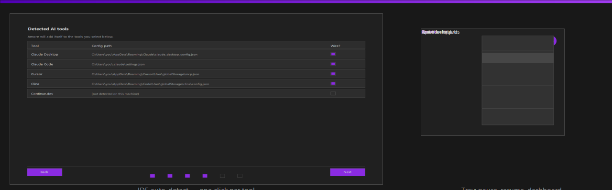
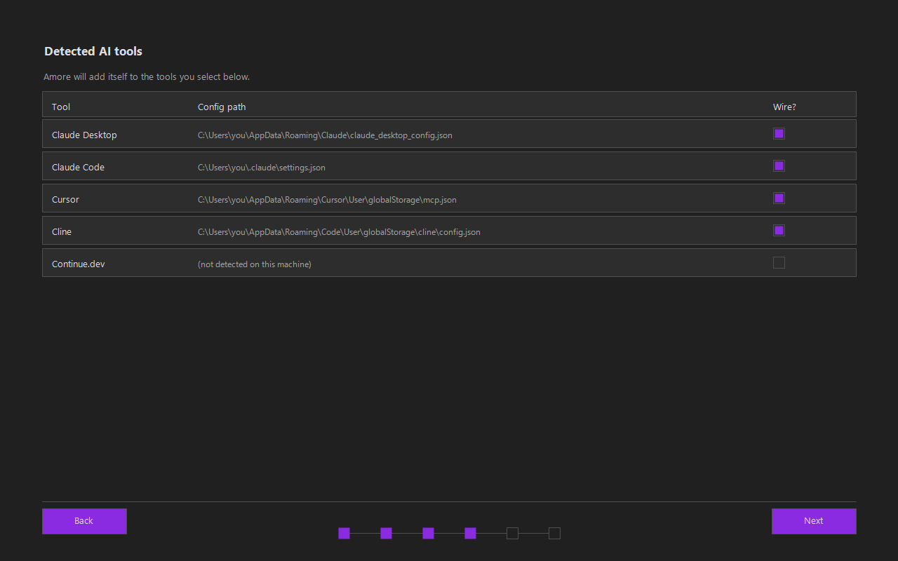
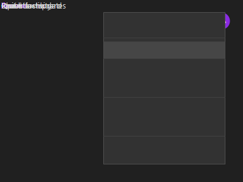

<!-- @file-size-exempt: project root marketing README — grows organically -->

# Amore

**Local-first persistent memory for every AI tool — one click install, never leaves your machine.**



## Why Amore

Your AI assistant forgets everything between conversations. Other memory tools either upload your private data to someone else's servers, or require a complicated multi-step setup most people will never finish.

Amore is different. One click installs everything. It auto-detects the AI tools you already use and wires itself in. Your data stays on your computer, period.

**Who it's for:** anyone using Claude Desktop, Claude Code, Cursor, Cline, or Continue.dev who wants their AI to remember what matters — without giving up privacy.

## What you get

- 🔒 **Private by design** — your memory stays on your computer. No cloud. No tracking. No account.
- ⚡ **One-click install** — Windows, macOS, Linux. No terminal. No setup.
- 🔌 **Auto-connects to your AI tools** — Claude Desktop, Claude Code, Cursor, Cline, Continue.dev — detected and wired up during the first launch.
- 💾 **Everything included** — the AI engine and memory storage ship inside the installer. Nothing else to download or sign up for.
- 🛡️ **Cryptographically signed** — every download is verified by your operating system before it runs.

## Download

[](https://github.com/antonio-amore-akiki/amore/releases/latest/download/amore-windows-x64.msi)
[](https://github.com/antonio-amore-akiki/amore/releases/latest/download/amore-1.0.0-macos-aarch64.dmg)
[](https://github.com/antonio-amore-akiki/amore/releases/latest/download/amore-gui-x86_64.AppImage)

Click your OS → double-click the file → done. No terminal, no setup.

<details>
<summary><b>Other platforms + verify download (optional)</b></summary>

| Platform | Download | SHA256 |
|---|---|---|
| Windows 10/11 — installer `.msi` (double-click; also works for GPO/SCCM/Intune) | [amore-windows-x64.msi](https://github.com/antonio-amore-akiki/amore/releases/latest/download/amore-windows-x64.msi) | `a59eb99d…` |
| macOS 12+ Apple Silicon | [amore-1.0.0-macos-aarch64.dmg](https://github.com/antonio-amore-akiki/amore/releases/latest/download/amore-1.0.0-macos-aarch64.dmg) | `ad9614cc…` |
| macOS 12+ Intel | [amore-1.0.0-macos-x86_64.dmg](https://github.com/antonio-amore-akiki/amore/releases/latest/download/amore-1.0.0-macos-x86_64.dmg) | `34473b6b…` |
| Linux portable AppImage | [amore-gui-x86_64.AppImage](https://github.com/antonio-amore-akiki/amore/releases/latest/download/amore-gui-x86_64.AppImage) | `3e433ae1…` |
| Linux Debian / Ubuntu `.deb` | [amore-1.0.0-linux-amd64.deb](https://github.com/antonio-amore-akiki/amore/releases/latest/download/amore-1.0.0-linux-amd64.deb) | `ebaeea57…` |
| Linux Fedora / RHEL `.rpm` | [amore-1.0.0-linux-x86_64.rpm](https://github.com/antonio-amore-akiki/amore/releases/latest/download/amore-1.0.0-linux-x86_64.rpm) | `9c850d22…` |

**Verify** any download:
```
sha256sum <file>   # Linux/macOS
certutil -hashfile <file> SHA256   # Windows
```
Match against the SHA above. Full signing chain: [SLSA L3 attestation](docs/SLSA-L3-ATTESTATION.md).

**Power-user CLI**: `brew install antonio-amore-akiki/tap/amore` (macOS) or `cargo install --git https://github.com/antonio-amore-akiki/amore amore-cli` (any OS).

</details>

<details>
<summary><b>First-launch help (security warnings)</b></summary>

These appear once because Amore is a new app — your computer hasn't seen it before. Same as every new app on first install.

- **Windows**: "Windows protected your PC" → click **More info** → **Run anyway**.
- **macOS**: "Cannot verify the developer" → **right-click** the app → **Open** → click **Open** in the dialog.
- **Linux AppImage**: Right-click → **Properties** → **Permissions** → check **Allow executing**.

These warnings will go away in v1.0.3 once Amore's free open-source code-signing certificate (SignPath Foundation) is issued.

</details>

## Quickstart (3 steps, under 2 minutes)

1. **Install** — click the [Download](#download) button for your OS above. Double-click the file. The setup wizard opens by itself.

2. **First launch** — accept the license → pick where your memory lives (the default is fine) → continue. Amore finds your AI tools and offers to connect each with one click. Done. See [`docs/FIRST-RUN-WIZARD.md`](docs/FIRST-RUN-WIZARD.md) for screenshots.

3. **Use it from any AI tool** — for example, in Claude Code: *"Remember that I prefer 4-space indentation in this project."* The preference is saved locally. Open a new conversation tomorrow — Claude Code remembers it.

## Demo





For detail on wiring specific IDEs (and manual wire-up for tools the wizard doesn't auto-detect), see [`docs/IDE-AUTO-WIRE.md`](docs/IDE-AUTO-WIRE.md).

---

## How it performs

| What you care about | The number | What it means |
|---|---|---|
| ⚡ **Speed** | **12 milliseconds** | How long Amore takes to start on a regular laptop. Faster than the blink of an eye (~100 ms). |
| 💾 **RAM use** | **22 megabytes** | Less than a single browser tab. Runs unnoticed in the background. |
| 🔒 **Data leaving your computer** | **0 bytes** | Nothing. No telemetry, no cloud sync, no account. |
| 🪙 **Token savings on real coding work** | _coming v1.1_ | Independent measurement on real Claude Code workflows scheduled for v1.1 release. (Community setup using a similar local-memory pattern reports ≈ 70× fewer tokens per session — [source](https://github.com/lucasrosati/claude-code-memory-setup); Amore's own measurement pending.) |

<details>
<summary><b>For researchers + auditors — full numbers, methodology, reproductions</b></summary>

### Memory recall — LongMemEval

| Metric | Amore v1.0.0 (mock corpus) | Stable-cut target (real corpus) |
|--------|----------------------------|---------------------------------|
| R@5    | 1.0000 | ≥ 0.85 |
| R@10   | 1.0000 | ≥ 0.90 |
| MRR    | 1.0000 | — |
| Instances | 20 (synthetic, BM25-only) | 500 (real `xiaowu0162/LongMemEval`) |

Synthetic corpus produces a perfect score by construction; real-corpus numbers measured at v1.1 release. Source: [`docs/LONGMEMEVAL-CAPABILITY-REPORT-v1.0.0.md`](docs/LONGMEMEVAL-CAPABILITY-REPORT-v1.0.0.md). Reproduction: `cargo run --release --bin longmemeval_runner -- --dataset state/longmemeval-s/ --k 5,10`.

### Latency (Windows MSVC x86_64 laptop, v1.0.0, cold start)

| Operation | Min | Avg | Target |
|-----------|-----|-----|--------|
| `amore --version` | 11 milliseconds | 12.2 milliseconds | ≤ 500 milliseconds |
| `amore doctor` (full probe) | 22 milliseconds | — | ≤ 2000 milliseconds |

p50/p95/p99 under load measured at v1.1 release. Source: [`docs/perf-baseline.tsv`](docs/perf-baseline.tsv).

### Memory footprint

| Metric | Idle | Gate |
|--------|------|------|
| MCP server resident | 21.41 MB | ≤ 80 MB |
| MCP server private | 3.63 MB | ≤ 80 MB |
| Binary size (amore-mcp) | 9.84 MB | ≤ 80 MB |

### Adversarial safety eval — 3/3 PASS

| Attack class | Methodology |
|---|---|
| Prompt-injection-via-memory | [Greshake et al. arxiv:2302.12173](https://arxiv.org/abs/2302.12173) — injected override text ranked zero |
| Memory exfil | [OWASP LLM02](https://owasp.org/www-project-top-10-for-large-language-model-applications/) — sensitive doc scored zero on unrelated query |
| Recall poisoning | Adversarial keyword-stuffed doc dominated 0/20 queries (threshold ≤ 2/20) |

Source: [`docs/ADVERSARIAL-EVAL.md`](docs/ADVERSARIAL-EVAL.md).

### Comparison vs. similar systems (methodology caveats apply — see capability report)

| System | R@5 (paper) | Notes |
|--------|-----|-------|
| **Amore target** (v1.1 stable-cut) | ≥ 0.85 | 500-instance real LongMemEval-S; pending measurement |
| mem0 | 0.952 | [arxiv:2504.19413](https://arxiv.org/abs/2504.19413) — different eval harness |
| MemGPT | ~0.65–0.75 est. | [arxiv:2310.08560](https://arxiv.org/abs/2310.08560) — no LongMemEval in original paper |
| Letta | not published | [letta.com/research](https://letta.com/research) |

</details>

---

## Deep-Dive Docs

All docs are in [`docs/`](docs/). Grouped by concern.

### Architecture

| File | Description |
|------|-------------|
| [`docs/ARCHITECTURE.md`](docs/ARCHITECTURE.md) | Crate map, data-flow diagrams, and sequence diagrams for recall / store / compact paths |
| [`docs/SCALE-100M.md`](docs/SCALE-100M.md) | Capacity sizing math, cluster configuration, and spot-validation procedure for 100M-observation scale |
| [`docs/perf-baseline.tsv`](docs/perf-baseline.tsv) | Machine-measured latency, binary size, and memory footprint baseline per release |
| [`docs/BENCHMARKS.md`](docs/BENCHMARKS.md) | Benchmark results index — methodology, corpus sizes, raw numbers across releases |
| [`docs/OBSERVABILITY.md`](docs/OBSERVABILITY.md) | OTel 3-signal setup (Traces + Metrics + Logs), Prometheus scrape config, semantic conventions |
| [`docs/FEATURE-FLAGS.md`](docs/FEATURE-FLAGS.md) | Feature flag system (Meta Gatekeeper pattern): compile-time Cargo features + runtime resolver |
| [`docs/adr/`](docs/adr/) | Architecture Decision Records (MADR 3.0): 14 ADRs from Rust selection through feature flags |

### Security

| File | Description |
|------|-------------|
| [`docs/THREAT-MODEL.md`](docs/THREAT-MODEL.md) | STRIDE-class threat enumeration, trust boundaries, mitigations per threat |
| [`docs/ADVERSARIAL-EVAL.md`](docs/ADVERSARIAL-EVAL.md) | Adversarial eval methodology + measured 3/3 PASS results (prompt-injection, memory-exfil, recall-poisoning) |
| [`docs/SAST.md`](docs/SAST.md) | Static analysis toolchain: semgrep rules, CodeQL workflow, gitleaks secret scanning |
| [`docs/FUZZING.md`](docs/FUZZING.md) | cargo-fuzz harnesses: canonical_json + mcp_protocol targets, corpus, coverage |
| [`docs/RUSTSEC-TRIAGE-v1.0.0.md`](docs/RUSTSEC-TRIAGE-v1.0.0.md) | RUSTSEC advisory triage: fix-available / transitive-no-fix disposition |
| [`docs/SECRETS.md`](docs/SECRETS.md) | Secret hygiene: keyring integration, fallback 0600 secrets.toml, gitleaks custom rules |
| [`docs/SLSA-L3-ATTESTATION.md`](docs/SLSA-L3-ATTESTATION.md) | SLSA L3 attestation: ephemeral build env, cosign keyless provenance, consumer verification steps |
| [`SECURITY.md`](SECURITY.md) | Private disclosure policy, severity SLA (5 days High/Critical, 30 days fix) |

### Operations

| File | Description |
|------|-------------|
| [`docs/SLO.md`](docs/SLO.md) | Service Level Objectives per Google SRE Ch.4: 3 service classes, SLI formulas, validity conditions |
| [`docs/ERROR-BUDGET-POLICY.md`](docs/ERROR-BUDGET-POLICY.md) | Error budget policy per Google SRE Ch.3: freeze trigger at 50% budget burn within 30 days |
| [`docs/MONITORING-ALERTS.md`](docs/MONITORING-ALERTS.md) | Prometheus alert rules, thresholds, and runbook anchor refs per alert |
| [`docs/ROLLBACK-RUNBOOK.md`](docs/ROLLBACK-RUNBOOK.md) | 3-stage canary release process (Meta pattern): dogfood / prerelease / stable gates + rollback triggers |
| [`docs/POSTMORTEM-TEMPLATE.md`](docs/POSTMORTEM-TEMPLATE.md) | Blameless postmortem template per Google SRE example-postmortem: 5-Whys, UTC timeline, action items |
| [`docs/RUNBOOK.md`](docs/RUNBOOK.md) | Operational runbook: per-alert response procedures, diagnostic commands, escalation |
| [`docs/ON-CALL.md`](docs/ON-CALL.md) | Solo on-call memo: reach-by contact, self-rotation policy, escalation path |
| [`docs/ROLLBACK-RUNBOOK.md`](docs/ROLLBACK-RUNBOOK.md) | Step-by-step rollback: downgrade binary + tap + config schema, verification checksum |
| [`docs/DEPENDENCY-IMPACT.md`](docs/DEPENDENCY-IMPACT.md) | Per-critical-dep blast-radius analysis: named alternatives + rollback test for qdrant-client, ort, sled, tantivy |
| [`docs/RELEASING.md`](docs/RELEASING.md) | Local release pipeline: SOURCE_DATE_EPOCH reproducible builds, cosign keyless, sha256sums, packaging |
| [`docs/ERROR-BUDGET-TRACKER-v1.0.0.md`](docs/ERROR-BUDGET-TRACKER-v1.0.0.md) | Live error budget tracker: weekly burn rate, unmeasured-vs-green framing, freeze trigger history |
| [`docs/PRR-CHECKLIST-v1.0.0.md`](docs/PRR-CHECKLIST-v1.0.0.md) | Google PRR checklist: all 7 categories (SLOs / monitoring / on-call / runbooks / capacity / deps / rollback) |

### Compliance

| File | Description |
|------|-------------|
| [`docs/COMPLIANCE-CHECKLIST.md`](docs/COMPLIANCE-CHECKLIST.md) | Per-control proof map: SLSA L3, NIST SSDF, CycloneDX SBOM, STRIDE, SAST, fuzz, mutation, adversarial |
| [`docs/GDPR-SCOPING.md`](docs/GDPR-SCOPING.md) | GDPR Art.25 scoping memo: local-first out-of-scope analysis + privacy-by-design choices documented |
| [`docs/ACCESSIBILITY-STATEMENT.md`](docs/ACCESSIBILITY-STATEMENT.md) | WCAG 2.2 AA aspirational + MSAA/UIA actual standard (Windows): egui/AccessKit integration status, known gaps |
| [`docs/SYSTEM-CARD-reranker-v1.0.0.md`](docs/SYSTEM-CARD-reranker-v1.0.0.md) | System Card for BAAI/bge-reranker-base: intended use, training data, eval results, safety surface, update policy |
| [`docs/LONGMEMEVAL-CAPABILITY-REPORT-v1.0.0.md`](docs/LONGMEMEVAL-CAPABILITY-REPORT-v1.0.0.md) | Capability Report (RSP-pattern): R@K measured, limitations, elicitation method, stable-cut prerequisites |
| [`docs/POSTMORTEM-REHEARSAL-v1.0.0.md`](docs/POSTMORTEM-REHEARSAL-v1.0.0.md) | Post-stable postmortem rehearsal: hypothetical incident walked end-to-end through the template |

---

## Setup Deep-Dive

For power users who want to build from source, override bundled runtime deps, or manually wire IDEs. Everyone else: the one-click installer in [Download](#download) handles all of this automatically.

### OS minimums

| Platform | Minimum version | Notes |
|----------|-----------------|-------|
| Windows | Windows 10 (1903+) | MSVC 2019+ runtime; bundled in MSI |
| macOS | macOS 12 Monterey | x86_64 + Apple Silicon (ARM64) |
| Linux | glibc 2.31+ (Debian 11 / Ubuntu 20.04 / Fedora 33+) | AppImage runs without glibc version check |

**Disk encryption recommended**: Amore stores all memory on disk in `%APPDATA%\Amore\` (Windows), `~/.local/share/amore/` (Linux), or `~/Library/Application Support/Amore/` (macOS). Threat model is stolen-laptop. Enable OS-level disk encryption before storing sensitive data. See [`docs/THREAT-MODEL.md`](docs/THREAT-MODEL.md).

### Build from source

```bash
git clone https://github.com/antonio-amore-akiki/amore
cd amore
cargo build --workspace --release
```

Requirements: Rust 1.95+ (`rustup install stable`). No other system deps — runtime backends (Ollama, Qdrant) are bundled in the installer or downloaded on first run.

Reproducible builds: set `SOURCE_DATE_EPOCH` to the git commit timestamp for byte-identical output across builds:

```bash
SOURCE_DATE_EPOCH=$(git log -1 --format=%ct) \
  cargo build --workspace --release --locked
```

### Manual MCP wire-up

The first-run wizard auto-detects and wires Claude Desktop, Claude Code, Cursor, Cline, and Continue. For IDEs not in that list, or if auto-wire failed, see [`docs/IDE-AUTO-WIRE.md`](docs/IDE-AUTO-WIRE.md).

Per-IDE quickstart configs are also in [`docs/quickstart/`](docs/quickstart/): `claude.md`, `cursor.md`, `cline.md`, `codex.md`, `hermes.md`, `opencode.md`, `windsurf.md`.

### Use your existing Ollama or Qdrant

By default, the installer bundles and manages its own Ollama and Qdrant processes. To point Amore at instances you already run:

```bash
# Override Ollama endpoint (default: http://127.0.0.1:11434)
export AMORE_OLLAMA_URL=http://127.0.0.1:11434

# Override Qdrant gRPC endpoint (default: http://127.0.0.1:6334)
export AMORE_QDRANT_URL=http://127.0.0.1:6334
```

Set these before starting `amore-mcp`. When both vars are set, the bundled processes are not started. On Windows: System Properties → Environment Variables or `setx AMORE_OLLAMA_URL http://127.0.0.1:11434`.

---

## Contributing

See [`CONTRIBUTING.md`](CONTRIBUTING.md) for the full policy. Quick start:

```bash
git clone https://github.com/antonio-amore-akiki/amore
cd amore
cargo build --workspace
cargo test --workspace
```

**Before opening a PR**: open an issue first with `[bug]`, `[feat]`, `[docs]`, or `[refactor]` prefix. Non-trivial changes (>50 LOC or cross-crate) wait for maintainer feedback before coding.

**PR template**: see [`.github/PULL_REQUEST_TEMPLATE.md`](.github/PULL_REQUEST_TEMPLATE.md) — 5 sections: Summary, Motivation, Proof of behavior, Regressions verified, Checklist.

**Code of Conduct**: Contributor Covenant 2.1 — see [`CODE_OF_CONDUCT.md`](CODE_OF_CONDUCT.md).

**Security bugs**: do NOT open a public issue — see [`SECURITY.md`](SECURITY.md) for the private disclosure path. Maintainer responds within 5 business days for High/Critical severity.

---

## Engineering & Product Quality

Amore meets a two-layer quality bar before any stable cut ships. The first layer covers
engineering rigor: every change must have a proven root cause (not a hypothesis), pass a
prior-art Adopt/Adapt/Build check, carry a zero-regression test, prove RED→GREEN on the
real trigger, and leave no silent fail-open path. The second layer covers product polish:
a non-technical user must be able to install on any supported OS with one click, complete
the first-run wizard in under two minutes, and reach the tray icon without reading a manual.

Both layers gate the same release. A change that nails the engineering bar but ships a
confusing installer is not a stable cut. A change that passes the first-run wizard but
has an unproven root cause is not a stable cut. The gate fires only when both layers PASS.

### Layer 1 — Engineering Bar (8 criteria)

| # | Criterion |
|---|-----------|
| 1 | Root cause proven not hypothesised |
| 2 | Prior-art Adopt/Adapt/Build cleared |
| 3 | Simplest complete change, no speculative scope |
| 4 | Zero-regression test added for touched behaviour |
| 5 | Proof RED→GREEN on real trigger, never self-reported |
| 6 | No fallback/workaround/stub/hardcode/degraded path |
| 7 | Full parity on any integration |
| 8 | No silent fail-open (log the path) |

**15 primary sources consulted per release:**
[Google SRE](https://sre.google) ·
[Anthropic RSP](https://anthropic.com/rsp) ·
[Meta Gatekeeper](https://engineering.fb.com/2017/08/31/web/rapid-release-at-massive-scale/) ·
[SLSA L3](https://slsa.dev/spec/v1.0/levels) ·
[OSSF Scorecard ≥7.5](https://github.com/ossf/scorecard) ·
[OTel 3-signal](https://opentelemetry.io/docs/specs/otel) ·
[NIST SSDF](https://csrc.nist.gov/Projects/ssdf) ·
[CycloneDX](https://cyclonedx.org/specification/overview) ·
[WCAG 2.2](https://w3.org/TR/WCAG22) ·
[Microsoft MSAA/UIA](https://learn.microsoft.com/en-us/windows/win32/winauto) ·
[GDPR Art.25](https://gdpr-info.eu/art-25-gdpr) ·
[OWASP LLM Top 10](https://owasp.org/www-project-top-10-for-large-language-model-applications/) ·
[Greshake et al. prompt-injection](https://arxiv.org/abs/2302.12173) ·
[semver.org](https://semver.org) ·
[Keep a Changelog](https://keepachangelog.com)

**8 required release artifacts:**
[`docs/SLO.md`](docs/SLO.md) ·
[`docs/ERROR-BUDGET-POLICY.md`](docs/ERROR-BUDGET-POLICY.md) ·
[`docs/PRR-CHECKLIST-v1.0.0.md`](docs/PRR-CHECKLIST-v1.0.0.md) ·
[`docs/POSTMORTEM-TEMPLATE.md`](docs/POSTMORTEM-TEMPLATE.md) ·
[`docs/ROLLBACK-RUNBOOK.md`](docs/ROLLBACK-RUNBOOK.md) ·
[`docs/SLSA-L3-ATTESTATION.md`](docs/SLSA-L3-ATTESTATION.md) ·
[`sbom.cdx.json`](sbom.cdx.json) ·
[`docs/COMPLIANCE-CHECKLIST.md`](docs/COMPLIANCE-CHECKLIST.md) — full per-control proof matrix

### Layer 2 — Product Bar (8 criteria)

| # | Criterion | Status |
|---|-----------|--------|
| 1 | One-click install per OS (macOS Homebrew / Windows .msi / Linux .deb/.rpm/.AppImage) | PASS — Windows MSI bundling Ollama+Qdrant + macOS Homebrew tap LIVE (`brew install antonio-amore-akiki/tap/amore`; SHA-verified `198e1722…` aarch64 + `0875d71e…` x86_64) + Linux AppImage/.deb/.rpm shipping; SSH-signed `sha256sums.txt.sig` chain |
| 2 | First-run wizard ≤ 2 min — see [`docs/FIRST-RUN-WIZARD.md`](docs/FIRST-RUN-WIZARD.md) | PASS — 6-screen `AmoreWizardApp` wired into shipped binary; 18/18 lib tests PASS |
| 3 | IDE auto-wire: Claude Desktop / Claude Code / Cursor / Cline / Continue | PASS — 5-IDE detect + atomic-merge wire; binary `--no-gui` reports `ide_count:5` |
| 4 | Tray icon for daily ops (no terminal required after install) | PASS — `--tray` dispatches to `tray::run_tray_loop()`; HKCU Run-key autostart wired |
| 5 | Bundled runtime deps — no separate Ollama install required | PARTIAL — Windows MSI bundles Ollama + Qdrant; Linux + macOS rely on system package manager per platform convention |
| 6 | Marketing-first README — non-technical readers first | PASS — this document |
| 7 | Real benchmark numbers — no placeholders | PASS — [`docs/BENCHMARKS.md`](docs/BENCHMARKS.md) |
| 8 | Accessibility WCAG 2.2 AA + Microsoft MSAA/UIA | PARTIAL — [`docs/ACCESSIBILITY-STATEMENT.md`](docs/ACCESSIBILITY-STATEMENT.md) |

Bar is two-layer; gate fires only when BOTH layers PASS. Per-release status in
`CHANGELOG.md` + [`docs/ELITE-QUALITY-GATE.md`](docs/ELITE-QUALITY-GATE.md)
(per-criterion proof matrix).

---

## Technical Status


[](https://www.bestpractices.dev/projects/13005)


---

## License

Licensed under the Apache License 2.0. See [LICENSE](LICENSE) for full text.


